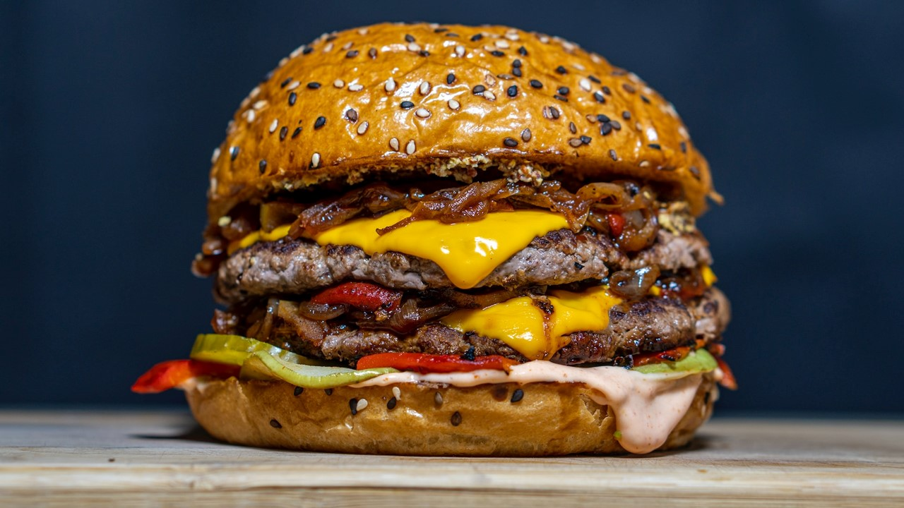

# Pag-Hotel---Taller-3

## Link Pagina
https://santicg.github.io/Pag-Hotel---Taller-3/

## ¿Por qué este proyecto? 
Este proyecto tiene como objetivo desarrollar una tienda en línea sencilla para un hotel que permita a los huéspedes explorar y adquirir productos de manera rápida y eficiente. La tienda ofrece una experiencia intuitiva, donde los clientes pueden agregar, eliminar y editar productos en su carrito de compras. Además, se integra un proceso de checkout simplificado que utiliza WhatsApp para enviar el pedido directamente al hotel, facilitando la comunicación y confirmación del pedido sin necesidad de un sistema de pagos en línea, dado que el pago se realizará en efectivo al momento de la entrega. Este enfoque garantiza una solución accesible y conveniente tanto para el hotel como para los huéspedes.

## Puntos claves para la maquetación
### 1. **Estructura de tres secciones principales:**

-   **Galería de productos**: Visualmente organizada en un grid para mostrar los productos disponibles.
-   **Carrito de compras**: Un panel fijo o flotante que esté siempre visible o anclado en un lateral (por ejemplo, a la derecha), mostrando los productos agregados y su total.
-   **Botón de checkout**: Ubicado debajo del carrito, con un botón claro y destacado que llevará al proceso de enviar el pedido a WhatsApp.

### 2. **Uso de un layout en columnas:**

-   Utiliza un layout tipo **flexbox** o **grid** para que la galería de productos y el carrito estén organizados en columnas. La galería de productos ocupará la mayor parte de la pantalla (70-80%) y el carrito ocupará el restante (20-30%).

### 3. **Galería de productos:**

-   Los productos deben estar en un **grid** o **flexbox** para que sean responsivos y ocupen el espacio de forma uniforme.
-   Cada tarjeta de producto incluirá una imagen, el nombre del producto, el precio y el botón para agregarlo al carrito.
-   Las tarjetas deben ser lo suficientemente grandes para ser legibles, pero compactas para mostrar múltiples productos a la vez.

### 4. **Carrito de compras fijo en la página:**

-   El carrito estará siempre visible en un lateral (derecha o izquierda). Será un **contenedor fijo** que mostrará los productos agregados.
-   El carrito debe incluir:
    -   Nombre del producto.
    -   Cantidad (con botones para aumentar o disminuir).
    -   Precio total por producto.
    -   Botón para eliminar productos.
    -   Precio total acumulado en la parte inferior.

### 5. **Botón de checkout:**

-   Este botón debe ser grande, visible y estar anclado en el carrito, preferiblemente en la parte inferior.
-   Un estilo destacado con colores llamativos que respeten la marca para indicar que es el último paso para finalizar la compra.
### 6. **Uso de espacio y legibilidad:**

-   Los elementos de texto, botones y productos deben tener un espaciado adecuado para mejorar la experiencia visual y facilitar la interacción en pantallas táctiles.
-   **Fuentes legibles** y contrastes de color claros para facilitar la lectura y los clics.

### 7. **Interactividad simple y fluida:**

-   Evitar el uso de muchas animaciones para que la página sea rápida y fluida.

### 8. **Enlace a WhatsApp:**

-   Al hacer clic en el botón de checkout, el mensaje generado con los productos y el precio total se debe enviar automáticamente a WhatsApp, manteniendo el diseño del carrito actualizado hasta el último momento.
-   El botón de checkout debe llevar a una página de confirmación o directamente al enlace de WhatsApp.

## Prototipo en Figma


## Contenedor Productos


```html
<div  class="col-lg-4 col-md-6 wow fadeInUp"  data-wow-delay="0.1s">

	<div  class="room-item shadow rounded overflow-hidden">

		<div  class="position-relative">

			

		</div>

		<div  class="p-4 mt-2">

			<div  class="d-flex justify-content-between mb-3">

				<h5  class="mb-0">Hamburguesa</h5>

				<div  class="ps-2">

					<small  class="fa fa-star text-primary"></small>

					<small  class="fa fa-star text-primary"></small>

					<small  class="fa fa-star text-primary"></small>

					<small  class="fa fa-star text-primary"></small>

					<small  class="fa fa-star text-primary"></small>

				</div>

			</div>

			<p  class="text-body mb-3">Disfruta de nuestra jugosa hamburguesa de carne 100% Angus, acompañada de bacon caramelizado, queso cheddar derretido y vegetales frescos. Todo ello coronado con nuestra salsa especial de la casa, servido en un suave pan brioche dorado.</p>

			<p></p>

			<hr>

			<div  class="d-flex justify-content-between">

				<a  class="btn btn-sm btn-primary rounded py-2 px-4"  href="">Agregar</a>

				<a  class="btn btn-sm btn-dark rounded py-2 px-4"  href="">$45.000</a>

			</div>

		</div>

	</div>

</div>
```

## Botones
 


### HTML
```html
<div  class="d-flex justify-content-between">

	<a  class="btn btn-sm btn-primary rounded py-2 px-4"  href="">Agregar</a>

	<a  class="btn btn-sm btn-dark rounded py-2 px-4"  href="">$45.000</a>

</div>
```
### CSS
```css
.btn {

font-weight: 500;

text-transform: uppercase;

transition: .5s;

}

  

.btn.btn-primary,

.btn.btn-secondary {

color: #FFFFFF;

}

  

.btn-square {

width: 38px;

height: 38px;

}

  

.btn-sm-square {

width: 32px;

height: 32px;

}

  

.btn-lg-square {

width: 48px;

height: 48px;

}

  

.btn-square,

.btn-sm-square,

.btn-lg-square {

padding: 0;

display: flex;

align-items: center;

justify-content: center;

font-weight: normal;

border-radius: 2px;

}
```
## Tabla de Carrito


### HTML
```html
<tr>

	<td  class="thumbnail-img">

		<a  href="#">

			

		</a>

	</td>

	<td  class="name-pr">

		<a  href="#">

			Hamburguesa

		</a>

	</td>

	<td  class="price-pr">

		<p>$ 45.000</p>

	</td>

	<td  class="quantity-box"><input  type="number"  size="4"  value="2"  min="0"  step="1"  class="c-input-text qty text"></td>

	<td  class="total-pr">

		<p>$ 90.000</p>

	</td>

	<td  class="remove-pr">

		<a  href="#">

	<i  class="fas fa-times"></i>

	</a>

	</td>

</tr>
```

## Resumen de compra


```html
<div  class="row my-5">

	<div  class="col-lg-4 col-sm-12">

		<div  class="order-box">

			<h3>Resumen de compra</h3>

			<div  class="d-flex">

				<h4>Sub Total</h4>

				<div  class="ml-auto font-weight-bold"> $ 230.000 </div>

				</div>

			<div  class="d-flex">

				<h4>Descuento</h4>

				<div  class="ml-auto font-weight-bold"> $ 30.000 </div>

			</div>

			<hr  class="my-1">

			<div  class="d-flex">

				<h4>Cupon de Descuento</h4>

				<div  class="ml-auto font-weight-bold"> $ 0 </div>

			</div>

			<div  class="d-flex">

				<h4>Impuestos</h4>

				<div  class="ml-auto font-weight-bold"> $ 38.000 </div>

			</div>

			<div  class="d-flex">

				<h4>Costo domicilio</h4>

				<div  class="ml-auto font-weight-bold"> $ 0 </div>

			</div>

			<hr>

			<div  class="d-flex gr-total">

				<h5>Total </h5>

				<div  class="ml-auto h5"> $ 238.000 </div>

			</div>

			<hr>  
		</div>

	</div>

	<div  class="col-12 d-flex shopping-box">

		<a  href=""  class="ml-auto btn hvr-hover"  id="whatsapp-link">Checkout</a>

	</div>

</div>
```
## Vinculación con whatsApp
### HTML


```html
<div  class="col-12 d-flex shopping-box">

	<a  href=""  class="ml-auto btn hvr-hover"  id="whatsapp-link">Checkout</a>

</div>
```
### JavaScript


```javascript
const  productos  = ["2 Hamburguesas", "1 Spa", "2 Mojitos"]; // Lista de productos del carrito

const  telefonoHotel  =  "573205955920"; // Numero del hotel en formato internacional

const  mensaje  =  `Hola, quiero hacer un pedido de los siguientes productos: ${productos.join(", ")}`;

  

document.getElementById('whatsapp-link').href  =  `https://wa.me/${telefonoHotel}?text=${encodeURIComponent(mensaje)}`;
